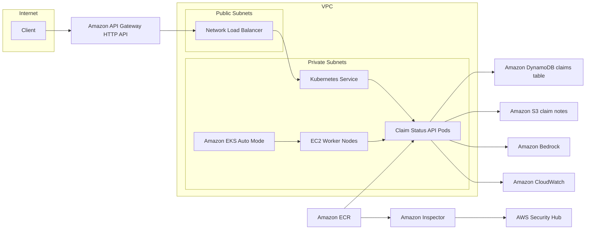

# GenAI Claim Status API (Lab)

This repository contains the deliverables for the GenAI-enabled Claim Status API lab.

## Folders
- src/ — service source + Dockerfile
- mocks/ — sample claim data and claim notes
- apigw/ — API Gateway artifacts
- iac/ — infrastructure-as-code templates
- pipelines/ — CI/CD pipeline definitions
- scans/ — security scan evidence
- observability/ — logs/metrics queries and screenshots

## Next steps

- Add scan and observability evidence under scans/ and observability/

## Architecture

## Architectural Reasoning

- EKS on EC2 was chosen to match the lab constraint (no Fargate) and to keep Kubernetes control over node sizing, networking, and add‑ons. Compared to ECS or Lambda, EKS provides closer parity with enterprise platform expectations and existing K8s operational practices.

- API Gateway (HTTP API) fronts the cluster to provide managed ingress, throttling, and auth integration without exposing the NLB directly. Compared to ALB-only ingress, this adds a stable public entry point and standardized API controls.

- DynamoDB stores claim status because it offers low‑latency reads, simple key‑value access for `GET /claims/{id}`, and no schema management. Compared to RDS, it avoids database administration and scales with demand.

- S3 stores claim notes to separate large unstructured content from transactional status data. Compared to storing notes in DynamoDB, S3 is cheaper for larger objects and integrates directly with batch/analytics tooling.

- Amazon Bedrock is used for summarization to satisfy GenAI requirements while keeping model selection and access governed by AWS. Compared to external model APIs, Bedrock simplifies network egress controls and IAM policy management.

- CodePipeline + CodeBuild provide AWS‑native CI/CD with ECR publishing and kubectl deployment to EKS. Compared to self‑hosted CI, this reduces operational overhead and integrates with IAM and audit trails.

- Amazon Inspector + Security Hub provide automated image scanning and centralized findings. Compared to ad‑hoc scanning scripts, this standardizes vulnerability management and reporting.

## Deployment

